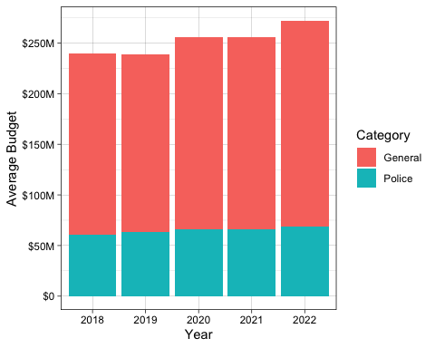
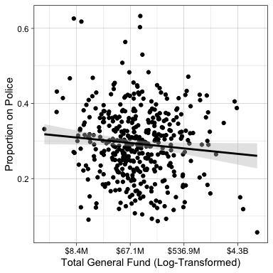
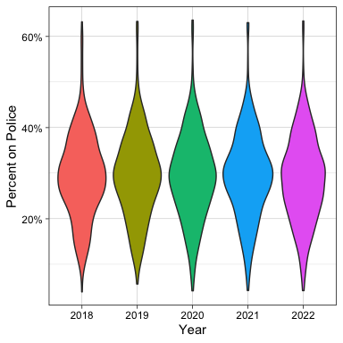
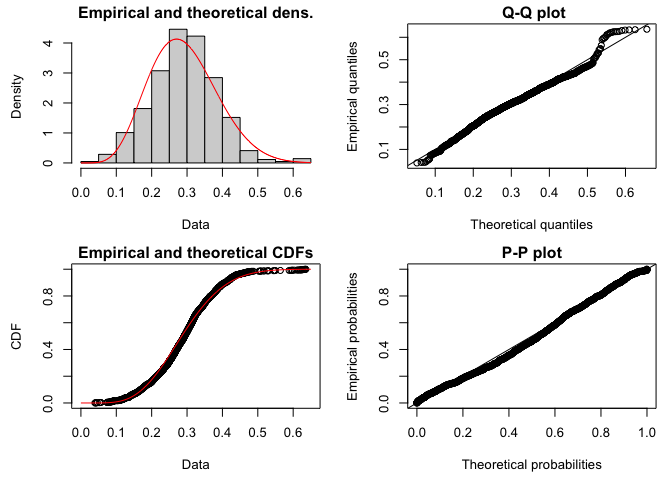
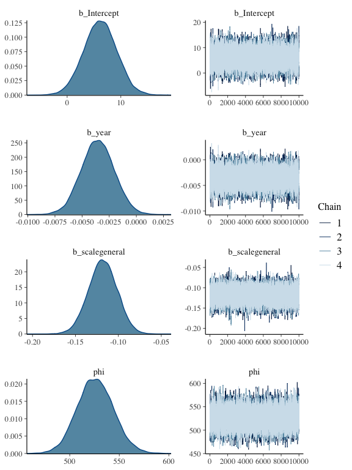
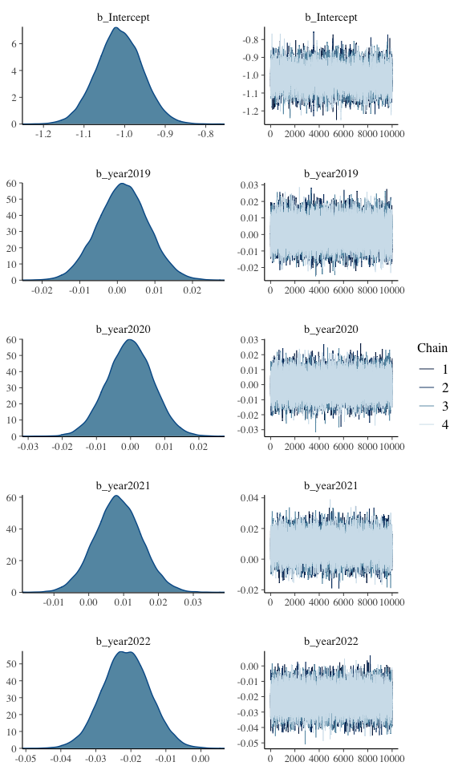
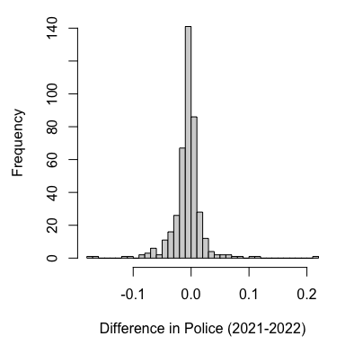
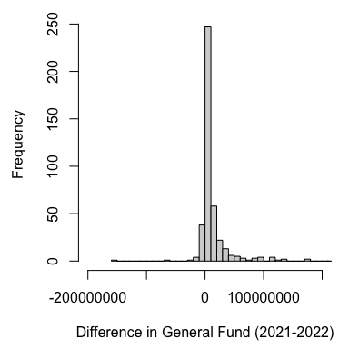

Police Budget Analysis (2018-2022)
================
Mason Youngblood
3/23/2022

This analysis was conducted for a collaborative article with [Andy
Friedman](https://github.com/afriedman412).

## Loading & Data Summary

First, we’ll set the working directory and load up all of the packages
for the analysis.

``` r
#set workspace
setwd("~/Documents/Work/Spring 2022/Police Budgets/police_budget_analysis_2018_2022")

#load packages
library(reshape2)
library(fitdistrplus)
library(brms)
library(ggplot2)
library(performance)
library(cowplot)
```

Next, we’ll load in the data. We should also go ahead and subset to only
include cities that include all five years of data.

``` r
#load data
data <- readxl::read_xlsx("police_budgets_2018_2022.xlsx")

#subset and clean data
data <- data[-which(is.na(data$p18) | is.na(data$gf18) | is.na(data$p19) | is.na(data$gf19) | is.na(data$p20) | is.na(data$gf20) | is.na(data$p21) | is.na(data$gf21) | is.na(data$p22) | is.na(data$gf22)), ]
data <- data[, which(colnames(data) %in% c("state", "city", "p18", "gf18", "p19", "gf19", "p20", "gf20", "p21", "gf21", "p22", "gf22"))]
colnames(data) <- c("state", "city", "p18", "g18", "p19", "g19", "p20", "g20", "p21", "g21", "p22", "g22")
```

Before doing anything else, let’s just plot the average police budgets
as a function of the average general fund budgets over time. The stacked
plots below are cumulative, so the total height of combined bars is the
total size of the average general fund in that year.

    ## quartz_off_screen 
    ##                 2

<!-- -->

Let’s see whether the proportion spent on police scales in a meaningful
way with the total general fund (log-transformed), using the data from
2019. For example, we might need to account for the fact that larger
cities (like NYC and LA) hit a funding plateau for their police
departments.

<!-- -->

It looks like there may be a slight negative trend between total general
fund and proportion spent on police, so we’ll control for it when we do
the modeling.

Now let’s clean up the data and convert it from a wide to a long format.

``` r
#convert cities and states to lower case
data$city <- as.factor(tolower(data$city))
data$state <- as.factor(tolower(data$state))

#restructure to be proportion spent on police
data_p <- data.frame(city = data$city, state = data$state, "2018" = data$p18/data$g18, "2019" = data$p19/data$g19, "2020" = data$p20/data$g20, "2021" = data$p21/data$g21, "2022" = data$p22/data$g22)

#convert police data to long format
data_p <- melt(data_p, id.vars = c("city", "state"))
colnames(data_p) <- c("city", "state", "year", "police")
data_p$year <- as.numeric(substr(data_p$year, 2, 5))

#do the same for general fund data and combine
data_g <- data.frame(city = data$city, state = data$state, "2018" = data$g18, "2019" = data$g19, "2020" = data$g20, "2021" = data$g21, "2022" = data$g22)
data_g <- melt(data_g, id.vars = c("city", "state"))
colnames(data_g) <- c("city", "state", "year", "general")
data_g$year <- as.numeric(substr(data_g$year, 2, 5))

#overwrite original data object, but keep stored as old_data
old_data <- data
data <- cbind(data_p, general = data_g$general)
```

Now let’s take a look at the distribution of budgets across the five
years to see if there are any obvious patterns in the data.

    ## quartz_off_screen 
    ##                 2

<!-- -->

## Assumption Check

Now we should some check some of our assumptions. First, let’s see
whether the proportion data is normally distributed using a Shapiro-Wilk
test.

``` r
#shapiro test
shapiro.test(data$police)
```

    ## 
    ##  Shapiro-Wilk normality test
    ## 
    ## data:  data$police
    ## W = 0.99066, p-value = 2.235e-10

*p* &lt; 0.05, which indicates that the data differs from a normal
distribution. Since the data is composed of proportions a beta
distribution is probably [more
appropriate](https://rcompanion.org/handbook/J_02.html). Let’s try it
and see how it looks.

``` r
#fit beta distribution
fit.beta <- fitdist(data$police, distr = "beta")
```

    ## $start.arg
    ## $start.arg$shape1
    ## [1] 6.70805
    ## 
    ## $start.arg$shape2
    ## [1] 16.27724
    ## 
    ## 
    ## $fix.arg
    ## NULL

<!-- -->

The beta distribution fits quite well so we’ll move forward with that.

We should also determine whether `state` should be included as a random
effect to account for state-level trends in spending. First, we will
compare two simple models of the 2018 data using [leave-one-out cross
validation](http://mc-stan.org/rstanarm/reference/loo.stanreg.html): the
first will have `year` as a fixed effect and `city` as a random effect,
and the second will have `year` as a fixed effect and `city` and `state`
as nested random effects. Then, we will calculate the [variable
decomposition based on the posterior predictive
distribution](https://easystats.github.io/performance/reference/icc.html)
for both models to see which one captures a higher ratio of the
variance.

``` r
#run random models
brms_city <- brm(police ~ (1|city), data, family = "beta", iter = 20000, cores = 8)
brms_state <- brm(police ~ (1|city) + (1|state), data, family = "beta", iter = 20000, cores = 8)

#add leave-one-out criterion
brms_city <- add_criterion(brms_city, "loo")
brms_state <- add_criterion(brms_state, "loo")

#save them
save(brms_city, file = "brms_output/brms_city.RData")
save(brms_state, file = "brms_output/brms_state.RData")
```

``` r
#compare models (elpd_diff = 0 is best)
loo_compare(brms_city, brms_state)
```

    ##            elpd_diff se_diff
    ## brms_state    0.0       0.0 
    ## brms_city  -779.5      83.1

``` r
#see which one captures more of the variance
variance_decomposition(brms_city)
```

    ## # Random Effect Variances and ICC
    ## 
    ## Conditioned on: all random effects
    ## 
    ## ## Variance Ratio (comparable to ICC)
    ## Ratio: 0.90  CI 95%: [0.89 0.91]
    ## 
    ## ## Variances of Posterior Predicted Distribution
    ## Conditioned on fixed effects: 0.00  CI 95%: [0.00 0.00]
    ## Conditioned on rand. effects: 0.01  CI 95%: [0.01 0.01]
    ## 
    ## ## Difference in Variances
    ## Difference: 0.01  CI 95%: [0.01 0.01]

``` r
variance_decomposition(brms_state)
```

    ## # Random Effect Variances and ICC
    ## 
    ## Conditioned on: all random effects
    ## 
    ## ## Variance Ratio (comparable to ICC)
    ## Ratio: 0.96  CI 95%: [0.95 0.96]
    ## 
    ## ## Variances of Posterior Predicted Distribution
    ## Conditioned on fixed effects: 0.00  CI 95%: [0.00 0.00]
    ## Conditioned on rand. effects: 0.01  CI 95%: [0.01 0.01]
    ## 
    ## ## Difference in Variances
    ## Difference: 0.01  CI 95%: [0.01 0.01]

The model that includes both `city` and `state` has a better fit and
accounts for more of the variance in the data, so we will move forward
including both variables as random effects.

## Modeling

Let’s go with a Bayesian non-linear mixed model assuming a beta
distribution. The model will be run with the default priors for 20,000
iterations to ensure chain mixing. The proportion of the budget spent on
`police` will be the outcome variable, `year` and the overall `general`
fund (scaled) will be predictor variables, and `city` and `state` will
be used as random effects to account for the repeated measures and
state-level trends, respectively. We will run this model twice: once
with `year` as a numeric variable to see if there is an overall time
trend, and again with `year` as a factor variable to do pairwise
comparisons.

Here is the first model:

``` r
#run model and save data
brms_num <- brm(police ~ year + scale(general) + (1|city) + (1|state), data, family = "beta", iter = 20000, cores = 8)
save(brms_num, file = "brms_output/brms_num.RData")
```

Let’s take a look at the results!

``` r
#print summary table
print(summary(brms_num), digits = 4)
```

    ##  Family: beta 
    ##   Links: mu = logit; phi = identity 
    ## Formula: police ~ year + scale(general) + (1 | city) + (1 | state) 
    ##    Data: data (Number of observations: 2095) 
    ##   Draws: 4 chains, each with iter = 20000; warmup = 10000; thin = 1;
    ##          total post-warmup draws = 40000
    ## 
    ## Group-Level Effects: 
    ## ~city (Number of levels: 406) 
    ##               Estimate Est.Error l-95% CI u-95% CI   Rhat Bulk_ESS Tail_ESS
    ## sd(Intercept)   0.3692    0.0141   0.3428   0.3982 1.0004     8566    13951
    ## 
    ## ~state (Number of levels: 51) 
    ##               Estimate Est.Error l-95% CI u-95% CI   Rhat Bulk_ESS Tail_ESS
    ## sd(Intercept)   0.3622    0.0411   0.2913   0.4508 1.0010    10452    15566
    ## 
    ## Population-Level Effects: 
    ##              Estimate Est.Error l-95% CI u-95% CI   Rhat Bulk_ESS Tail_ESS
    ## Intercept      6.1582    3.0820   0.1162  12.1527 1.0000    37746    27409
    ## year          -0.0036    0.0015  -0.0065  -0.0006 1.0000    37817    27040
    ## scalegeneral  -0.1181    0.0167  -0.1510  -0.0858 1.0001    16151    18270
    ## 
    ## Family Specific Parameters: 
    ##     Estimate Est.Error l-95% CI u-95% CI   Rhat Bulk_ESS Tail_ESS
    ## phi 526.0100   18.2997 490.9634 562.8592 1.0000    23477    25173
    ## 
    ## Draws were sampled using sampling(NUTS). For each parameter, Bulk_ESS
    ## and Tail_ESS are effective sample size measures, and Rhat is the potential
    ## scale reduction factor on split chains (at convergence, Rhat = 1).

``` r
#plot MCMC trace and density plots
plot(brms_num, variable = c("b_Intercept", "b_year", "b_scalegeneral", "phi"))
```

<!-- -->

The estimate for the effect of `year` on `police` is -0.0035514 with a
95% highest posterior density interval (HPDI) from -0.0065213 to
-0.0005606. In Bayesian models, HPDIs that do not overlap with 0
indicate that there is a significant effect. This means that there is a
small but significant negative time trend in the police budgeting data,
on the order of 0.35% per year. Additionally, there appears to be a
slightly significant negative effect of `general` on `police`, where
cities with a general fund that is 1 SD higher spend around 11% less per
year. The MCMC trace and density plots show that the model has converged
and the chains have adequate mixing.

Now let’s run the second model, where `year` is treated as a factor:

``` r
#convert year to factor
data$year <- as.factor(data$year)
```

``` r
#run model and save data
brms_fac <- brm(police ~ year + scale(general) + (1|city) + (1|state), data, family = "beta", iter = 20000, cores = 8)
save(brms_fac, file = "brms_output/brms_fac.RData")
```

``` r
#print summary table
print(summary(brms_fac), digits = 4)
```

    ##  Family: beta 
    ##   Links: mu = logit; phi = identity 
    ## Formula: police ~ year + scale(general) + (1 | city) + (1 | state) 
    ##    Data: data (Number of observations: 2095) 
    ##   Draws: 4 chains, each with iter = 20000; warmup = 10000; thin = 1;
    ##          total post-warmup draws = 40000
    ## 
    ## Group-Level Effects: 
    ## ~city (Number of levels: 406) 
    ##               Estimate Est.Error l-95% CI u-95% CI   Rhat Bulk_ESS Tail_ESS
    ## sd(Intercept)   0.3687    0.0140   0.3427   0.3975 1.0001     8127    13571
    ## 
    ## ~state (Number of levels: 51) 
    ##               Estimate Est.Error l-95% CI u-95% CI   Rhat Bulk_ESS Tail_ESS
    ## sd(Intercept)   0.3634    0.0409   0.2933   0.4536 1.0003    10215    15946
    ## 
    ## Population-Level Effects: 
    ##              Estimate Est.Error l-95% CI u-95% CI   Rhat Bulk_ESS Tail_ESS
    ## Intercept     -1.0129    0.0564  -1.1239  -0.9021 1.0003    12137    15077
    ## year2019       0.0015    0.0067  -0.0116   0.0148 1.0002    31787    27488
    ## year2020      -0.0002    0.0067  -0.0135   0.0130 1.0002    30902    29343
    ## year2021       0.0084    0.0067  -0.0048   0.0216 1.0002    31907    28399
    ## year2022      -0.0213    0.0068  -0.0346  -0.0080 1.0002    30854    29068
    ## scalegeneral  -0.1171    0.0165  -0.1494  -0.0846 1.0001    16219    18831
    ## 
    ## Family Specific Parameters: 
    ##     Estimate Est.Error l-95% CI u-95% CI   Rhat Bulk_ESS Tail_ESS
    ## phi 530.2075   18.5453 494.7690 567.5680 1.0002    24032    26037
    ## 
    ## Draws were sampled using sampling(NUTS). For each parameter, Bulk_ESS
    ## and Tail_ESS are effective sample size measures, and Rhat is the potential
    ## scale reduction factor on split chains (at convergence, Rhat = 1).

``` r
#plot MCMC trace and density plots, just for the intercept and other years
plot(brms_fac, variable = c("b_Intercept", "b_year2019", "b_year2020", "b_year2021", "b_year2022"))
```

<!-- -->

``` r
#run hypothesis function for pairwise comparisons
pairwise <- hypothesis(brms_fac, c("year2019 = 0",
                                   "year2020 - year2019 = 0",
                                   "year2021 - year2020 = 0",
                                   "year2022 - year2021 = 0"))

#return results
print(pairwise)
```

    ## Hypothesis Tests for class b:
    ##                Hypothesis Estimate Est.Error CI.Lower CI.Upper Evid.Ratio
    ## 1          (year2019) = 0     0.00      0.01    -0.01     0.01         NA
    ## 2 (year2020-year2019) = 0     0.00      0.01    -0.02     0.01         NA
    ## 3 (year2021-year2020) = 0     0.01      0.01     0.00     0.02         NA
    ## 4 (year2022-year2021) = 0    -0.03      0.01    -0.04    -0.02         NA
    ##   Post.Prob Star
    ## 1        NA     
    ## 2        NA     
    ## 3        NA     
    ## 4        NA    *
    ## ---
    ## 'CI': 90%-CI for one-sided and 95%-CI for two-sided hypotheses.
    ## '*': For one-sided hypotheses, the posterior probability exceeds 95%;
    ## for two-sided hypotheses, the value tested against lies outside the 95%-CI.
    ## Posterior probabilities of point hypotheses assume equal prior probabilities.

This indicates that the slightly negative trend in `police` is driven by
a significant difference of 2.9% between 2021 and 2022.

In summary, after accounting for state-level trends in spending and the
overall general fund size, there is a slight negative trend of 0.35% per
year that is driven by a difference of 2.9% between 2021 and 2022.

## City-Level Differences

Finally, let’s see if this difference between 2021 is 2022 is based on a
global trend, or whether it is caused by a small number of localities.

``` r
#construct data frame of percent change in police between 2021 and 2022
changes <- data.frame(city = data$city[which(data$year == 2021)], state = data$state[which(data$year == 2021)], police_2021 = data$police[which(data$year == 2021)], police_2022 = data$police[which(data$year == 2022)], diff = data$police[which(data$year == 2022)]-data$police[which(data$year == 2021)])
```

<!-- -->

Based on the above histogram, it appears that the difference in the
proportion spent on police between 2021 and 2022 is based on a slight
global decrease rather than being skewed by a small number of cities.
Let’s look at the top 10 cities in terms of decrease.

``` r
#reorder and look at top ten changes
changes <- changes[order(changes$diff, decreasing = FALSE), ]
changes[1:10,]
```

    ##              city state police_2021 police_2022        diff
    ## 19        kingman    az   0.3331638   0.1568974 -0.17626638
    ## 217       lansing    mi   0.3396786   0.1738994 -0.16577926
    ## 149       rexburg    id   0.3944476   0.2755132 -0.11893433
    ## 319    prineville    or   0.6301917   0.5265649 -0.10362682
    ## 146      meridian    id   0.3945103   0.3068920 -0.08761834
    ## 108         ocoee    fl   0.2490991   0.1688733 -0.08022573
    ## 26         tucson    az   0.3215839   0.2461993 -0.07538462
    ## 336    greenville    sc   0.2742548   0.2036209 -0.07063386
    ## 165    south bend    in   0.4173746   0.3469710 -0.07040360
    ## 53  redondo beach    ca   0.4446690   0.3766272 -0.06804184

Okay, now let’s check to see what the trend has been for general funds
in the same period.

``` r
#do the same for the overall general fund
changes_gf <- data.frame(city = data$city[which(data$year == 2021)], state = data$state[which(data$year == 2021)], gf_2021 = data$general[which(data$year == 2021)], gf_2022 = data$general[which(data$year == 2022)], diff = data$general[which(data$year == 2022)]-data$general[which(data$year == 2021)])
```

<!-- -->

Based on the above histogram (which excludes a few extreme positive
outliers, like Chicago), it appears that the difference in over general
funds between 2021 and 2022 trends positive. Let’s look at the top 10
cities in terms of increase.

``` r
#reorder and look at top ten changes
changes_gf <- changes_gf[order(changes_gf$diff, decreasing = TRUE), ]
changes_gf[1:10,]
```

    ##             city state    gf_2021     gf_2022      diff
    ## 153      chicago    il 4037639000  4887422000 849783000
    ## 91    washington    dc 9927445000 10709066000 781621000
    ## 325 philadelphia    pa 4804851000  5268946000 464095000
    ## 21       phoenix    az 1405970000  1582611000 176641000
    ## 347       austin    tx  940117723  1114356849 174239126
    ## 27          yuma    az   76418679   216224539 139805860
    ## 76        denver    co 1270874405  1408177205 137302800
    ## 57     san diego    ca 1620936801  1743548431 122611630
    ## 276  albuquerque    nm  595138000   714521000 119383000
    ## 42   los angeles    ca 4524684946  4640768971 116084025

While there are several outliers like Chicago, Washington, and
Philadelphia, it seems like the positive trend in general funds is
relatively global.
